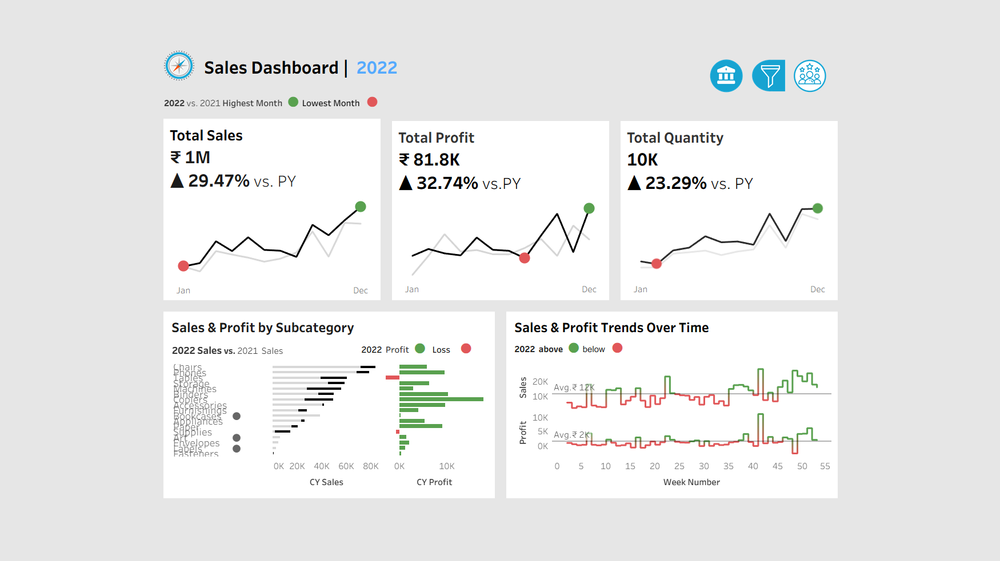
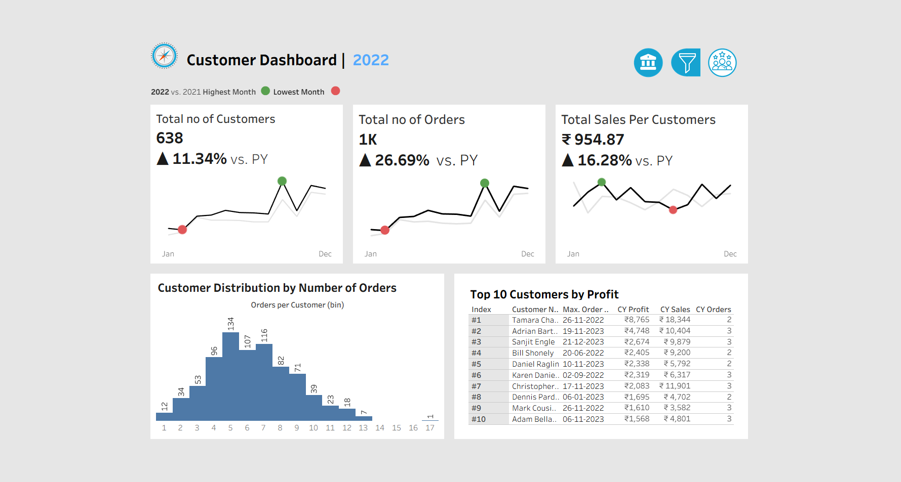

# 📊 Sales & Customer Performance Dashboard | Tableau 2022

An interactive, dual-dashboard Tableau project analyzing **Sales and Customer performance (2022 vs. 2021)** using the Sample Superstore dataset.

---

## 🚀 Project Overview
This project delivers a **business intelligence solution** through two interlinked dashboards:

- **Sales Dashboard** — Tracks revenue, profit, and product-level performance  
- **Customer Dashboard** — Analyzes customer growth, behavior, and contribution  

The goal is to transform raw data into **actionable insights for better decision-making**.

---

## 🎯 Business Objective
To evaluate:
- Sales and profit trends  
- Product-level profitability  
- Customer growth and engagement  

and identify **key growth drivers and loss-making areas**.

---

## 🧠 Executive Summary (Key Insight)
> **Sales increased by 29.47%, and profit grew by 32.74% year-over-year.**  
> However, **profitability is negatively impacted by specific subcategories like Tables despite high sales volume.**  
> Customer growth is steady, with a **small group of customers contributing significantly to total revenue.**

---

## 🔗 Live Dashboard
👉 https://public.tableau.com/app/profile/ajay.bingishetty/viz/SalesDashboard_17758102951790/CustomerDashboard  

---

## 📸 Dashboard Previews

### 📊 Sales Dashboard

### 👥 Customer Dashboard

---

# 📊 Sales Dashboard

## ✨ Key Features
- 📅 Year-over-Year Comparison — 2022 vs. 2021 with % change indicators  
- 📈 Sparkline KPI Cards — Monthly trends with highest & lowest markers  
- 📦 Sales & Profit by Subcategory — Identifies profit/loss areas  
- 📉 Sales & Profit Trends Over Time — Weekly performance tracking  
- 🟢🔴 Profit/Loss Indicators — Clear visual distinction for performance  

## 🔑 Insights
- Total Sales: **₹1M (+29.47% YoY)**  
- Total Profit: **₹81.8K (+32.74% YoY)**  
- Total Quantity: **10K (+23.29% YoY)**  
- Tables subcategory shows high sales but negative profit  
- Profitability varies significantly across product categories  
- Sales peaks observed in later months (seasonal trend)

---

# 👥 Customer Dashboard

## ✨ Key Features
- 👤 Customer Growth Tracking — Total customers and YoY change  
- 🧾 Order Volume Analysis — Total orders and growth trends  
- 📊 Sales per Customer KPI — Revenue efficiency metric  
- 🏆 Top 10 Customers by Profit — High-value customer identification  
- 📊 Customer Distribution Histogram — Order frequency behavior  
- 🔗 Interlinked Navigation — Seamless switching between dashboards  

## 🔑 Insights
- Total Customers: **638 (+11.34% YoY)**  
- Total Orders: **1K (+26.69% YoY)**  
- Sales per Customer: **₹954.87 (+16.28% YoY)**  
- Majority of customers place **4–8 orders**  
- Top customers contribute a significant portion of total revenue  

---

## 💡 Business Impact
- Identifies loss-making categories for corrective action  
- Supports pricing and inventory optimization decisions  
- Enables customer segmentation and retention strategies  
- Improves business performance monitoring using KPIs  

---

## 🛠 Tools & Technologies

| Tool | Usage |
|------|------|
| Tableau | Dashboard development & visualization |
| SQL | Data analysis & querying |
| Microsoft Excel | Data cleaning & preprocessing |

---

## 📁 Repository Structure

Sales-Customer-Dashboard-Tableau/
│
├── Sales-Customer-Dashboard-Tableau.twbx
├── Sales Dashboard.png
├── Customer Dashboard.png
└── README.md

---

## ⚙️ Key Skills Demonstrated
- Data Analysis  
- Data Visualization  
- Business Intelligence  
- Exploratory Data Analysis (EDA)  
- KPI Design & Tracking  
- Dashboard Development  
- Analytical Thinking  

---

## 📌 Project Outcome
This project demonstrates the ability to:
- Convert raw data into actionable business insights  
- Build interactive dashboards for decision-making  
- Apply analytical and business thinking to real-world data  

---

## 👤 Author
**Ajay Bingishetty**

- GitHub: https://github.com/ajayA2002  
- Tableau: https://public.tableau.com/app/profile/ajay.bingishetty/vizzes  
- LinkedIn: https://linkedin.com/in/bingishetty-ajay  

---

## ⭐ If you found this useful
Consider giving this repository a star ⭐
